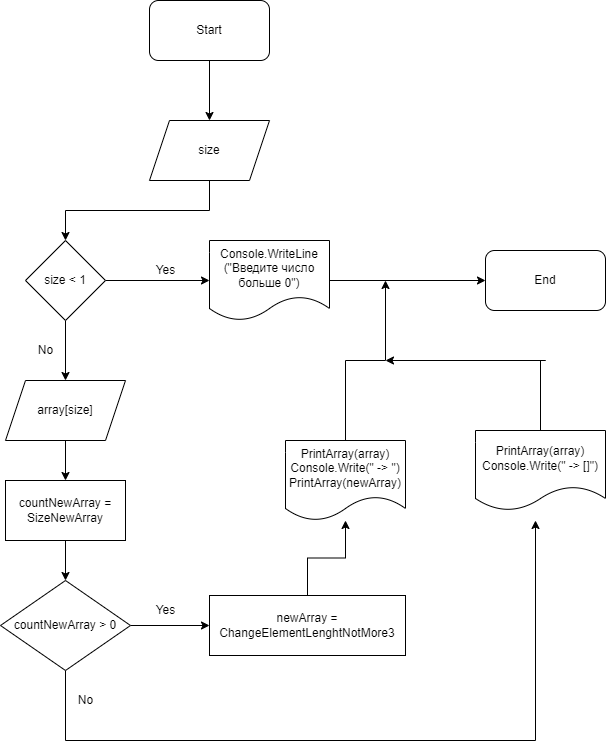
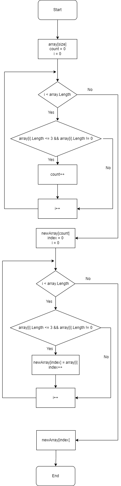
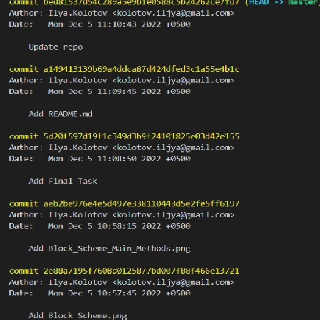

# Условие задачи
## Задача алгоритмически не самая сложная, однако для полноценного выполнения проверочной работы необходимо:

1. Создать репозиторий на GitHub
2. Нарисовать блок-схему алгоритма (можно обойтись блок-схемой основной содержательной части, если вы выделяете её в отдельный метод)
3. Снабдить репозиторий оформленным текстовым описанием решения (файл README.md)
4. Написать программу, решающую поставленную задачу
5. Использовать контроль версий в работе над этим небольшим проектом (не должно быть так, что всё залито одним коммитом, как минимум этапы 2, 3, и 4 должны быть расположены в разных коммитах)
## Задача:

Написать программу, которая из имеющегося массива строк формирует новый массив из строк, длина которых меньше, либо равна 3 символам. Первоначальный массив можно ввести с клавиатуры, либо задать на старте выполнения алгоритма. При решении не рекомендуется пользоваться коллекциями, лучше обойтись исключительно массивами.
# Решение
1. Создан репозиторий на [GitHub](https://github.com/Ilya-Kolotov/Final_Homework_1.git).
2. Нарисованы блок-схемы
+ Блок-схема основного алгоритма:

+ Блок-схема основных методов:

3. Создан файл README.md с текстовым описание решения.

4. Написана программа.
### Код программы:
string[] CreateArray(int size)

{

    string[] arr = new string[size];    
    for (int i = 0; i < size; i++)
    {
        Console.Write($"Введите элемент массива №{i + 1}:  ");
        arr[i] = Console.ReadLine();
    }
    return arr;
}

void PrintArray(string[] array)

{

    Console.Write("[\"");
    for (int i = 0; i < array.Length; i++)
    {
        if (i < array.Length - 1) Console.Write($"{array[i]}\", \"");
        else Console.Write($"{array[i]}");
    }
    Console.Write("\"]");

}

int SizeNewArray(string[] array)

{

    int count = 0;
    for (int i = 0; i < array.Length; i++)
    {
        if (array[i].Length <= 3 && array[i].Length != 0) count++;
    }
    return count;
}

string[] ChangeElementLenghtNotMore3(string[] array, int count)

{

    string[] newArr = new string[count];
    int index = 0;
    for (int i = 0; i < array.Length; i++)
    {
        if (array[i].Length <= 3 && array[i].Length != 0)
        {
            newArr[index] = array[i];
            index++;
        }
    }
    return newArr;
}

Console.Write("Введите количество элементов массива: ");

int size = Convert.ToInt32(Console.ReadLine());

if (size < 1)

    Console.WriteLine("Введите число больше 0");
else

{

    string[] array = CreateArray(size);
    PrintArray(array);

    int countNewArray = SizeNewArray(array);
    if (countNewArray > 0)
    {
        string[] newArray = ChangeElementLenghtNotMore3(array, countNewArray);
        Console.Write(" -> ");
        PrintArray(newArray);
    }
    else Console.Write(" -> []");
}

5. Добавлен контроль версий

